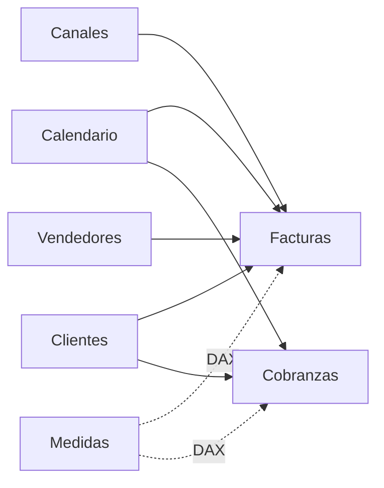
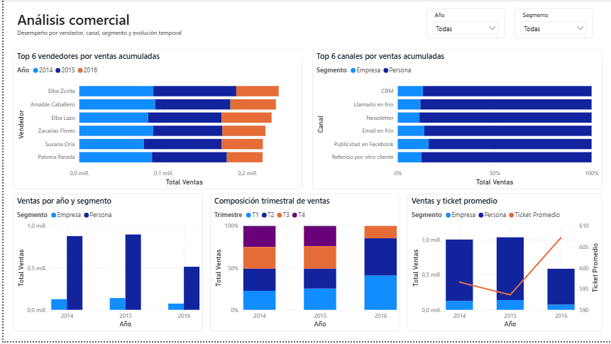

# Análisis de Ventas y Cobranzas con Power BI

Proyecto de **Business Intelligence** desarrollado en Power BI a partir de un caso académico y posteriormente refactorizado para portafolio. Integra preparación de datos con Power Query, modelado analítico, medidas DAX y un informe de tres páginas orientado al seguimiento comercial.


## Abrir y reproducir el proyecto

### Demo reproducible — recomendada

Descarga **[AnalisisVentas-PBIP-Demo.zip](https://github.com/Koke-Oliva/analisis-ventas-powerbi/raw/refs/heads/main/AnalisisVentas-PBIP-Demo.zip)**, descomprímelo y abre `AnalisisVentas.pbip` con Power BI Desktop.

Esta versión usa **datos sintéticos generados dentro de Power Query**, por lo que no requiere archivos externos ni credenciales. Permite revisar el modelo, actualizarlo e interactuar con las tres páginas del informe.

> **Importante:** la demo conserva la estructura analítica, las medidas, relaciones, filtros y visualizaciones del proyecto, pero sus valores numéricos no corresponden a los datos académicos originales ni deben compararse con las capturas de este README.

### Proyecto original — revisión técnica

También está disponible **[AnalisisVentas-PBIP.zip](https://github.com/Koke-Oliva/analisis-ventas-powerbi/raw/refs/heads/main/AnalisisVentas-PBIP.zip)**. Este paquete conserva las consultas del proyecto original con rutas locales genéricas, por ejemplo `C:\\Data\\AnalisisVentas\\...`.

Puede abrirse para revisar la estructura PBIP, el modelo semántico y el informe, pero **no puede actualizarse ni reproducir exactamente las cifras sin los archivos fuente originales** (`Ejer PBI.xlsx` y `Clientes.csv`), que no se redistribuyen.

## Objetivo

Construir un informe que permita:

- monitorear ventas, cobranzas y saldo pendiente;
- analizar desempeño por período, segmento, canal y vendedor;
- explorar detalle por país y ciudad;
- separar hechos, dimensiones y medidas de negocio;
- documentar el modelo con artefactos versionables de Power BI (**TMDL** y **PBIR**).

## Datos analizados

| Elemento | Registros / categorías |
|---|---:|
| Facturas | 4.400 |
| Registros de cobranza | 8.396 |
| Clientes | 320 |
| Canales comerciales | 9 |
| Vendedores | 12 |
| Países | 21 |

El período analizado comprende **2014–2016**. Los datos de 2016 son parciales y llegan hasta julio; por ello, ese año no debe compararse directamente con 2014 o 2015 sin considerar esta limitación.

## Modelo de datos



- **Hechos:** `Facturas`, `Cobranzas`
- **Dimensiones:** `Clientes`, `Canales`, `Vendedores`, `Calendario`
- **Medidas:** tabla dedicada `Medidas`

La dimensión `Calendario` se relaciona con ventas y cobranzas e incorpora atributos temporales con ordenamiento explícito para meses y trimestres.

## Preparación de datos con Power Query

Se aplicaron operaciones de conexión, limpieza y transformación, entre ellas:

- carga desde Excel y CSV;
- promoción de encabezados;
- asignación de tipos de datos;
- separación y normalización de campos de ubicación;
- preparación de las tablas utilizadas por el modelo analítico.

Las rutas de origen publicadas en los extractos técnicos se dejaron **genéricas** (`C:\Data\AnalisisVentas\...`) para no exponer rutas personales.

Los archivos fuente originales pertenecen al material académico del curso y **no se redistribuyen en este repositorio**.

## Medidas DAX principales

```DAX
Total Ventas =
SUM(Facturas[Monto Factura])

Total Cobros =
SUM(Cobranzas[MontoCobrado])

Saldo Pendiente =
[Total Ventas] - [Total Cobros]

Cantidad Facturas =
COUNTROWS(Facturas)

Clientes con venta =
DISTINCTCOUNT(Facturas[IDCliente])

Ticket Promedio =
DIVIDE([Total Ventas], [Cantidad Facturas])

Tasa Cobranza =
DIVIDE([Total Cobros], [Total Ventas])
```

`Tasa Cobranza` se interpreta como un indicador agregado dentro del contexto de filtro. No corresponde a una tasa de recuperación por cohorte de factura.

## Informe

### 1. Resumen ejecutivo


Incluye ventas, cobros, saldo pendiente, tasa de cobranza, clientes con venta y ticket promedio, además de evolución temporal y segmentación.

### 2. Análisis comercial



Incluye:

- Top 6 vendedores por ventas acumuladas;
- Top 6 canales por ventas acumuladas y composición por segmento;
- ventas por año y segmento;
- composición trimestral;
- evolución de ventas y ticket promedio.

Los conjuntos Top 6 se definen usando el ranking acumulado del período completo; los filtros del informe modifican los valores mostrados dentro de esas categorías.

### 3. Detalle comercial


Incluye una tabla de ventas por canal, país y segmento, una matriz jerárquica y filtros por año, segmento, país y ciudad.

Los filtros de **Año** y **Segmento** se sincronizan entre páginas para mantener el contexto de análisis.

## Resultados descriptivos

- **Ventas acumuladas:** 2.630.002,12
- **Cobros acumulados:** 2.541.968,54
- **Saldo ventas - cobros:** 88.033,58
- **Cobros / ventas:** 96,65 %
- El segmento **Persona** concentra aproximadamente **87,1 %** de las ventas acumuladas.
- **CRM** presenta el mayor monto acumulado entre los canales del conjunto de datos.

Estos resultados describen exclusivamente el conjunto de datos utilizado en el caso.

## Estructura publicada

```text
README.md
AnalisisVentas-PBIP.zip
AnalisisVentas-PBIP-Demo.zip
assets/
├── dashboard-resumen-ejecutivo.png
├── dashboard-analisis-comercial.png
└── dashboard-detalle-comercial.png
docs/
└── NOTAS_TECNICAS.md
src/
├── semantic-model/
│   ├── Calendario.tmdl
│   ├── Medidas.tmdl
│   ├── Facturas.tmdl
│   ├── Cobranzas.tmdl
│   ├── Clientes.tmdl
│   ├── Canales.tmdl
│   ├── Vendedores.tmdl
│   └── relationships.tmdl
└── report/
    ├── report.json
    └── pages.json
```

El repositorio ofrece dos formas de revisión: el paquete **original**, que conserva las consultas y requiere las fuentes académicas para actualizarse, y una **demo reproducible** con datos sintéticos autocontenidos. La carpeta `src/` mantiene extractos técnicos en texto para revisión rápida de DAX, calendario, relaciones y metadatos del informe. Las notas de reproducibilidad y alcance están en `docs/NOTAS_TECNICAS.md`.

## Tecnologías

- Power BI Desktop
- Power Query / lenguaje M
- DAX
- Power BI Project (`.pbip`)
- TMDL
- PBIR
- Git / GitHub

## Contexto académico

La versión inicial se desarrolló como actividad final del curso **Power BI: Herramientas Básicas para el Análisis de Datos** de TELEDUC, Pontificia Universidad Católica de Chile. Posteriormente se refactorizaron el modelo, las medidas, las visualizaciones y la documentación para convertirlo en un caso demostrable de portafolio. La publicación busca mostrar competencias de nivel junior en BI/Power BI de forma verificable, sin presentar el proyecto como una solución productiva.
