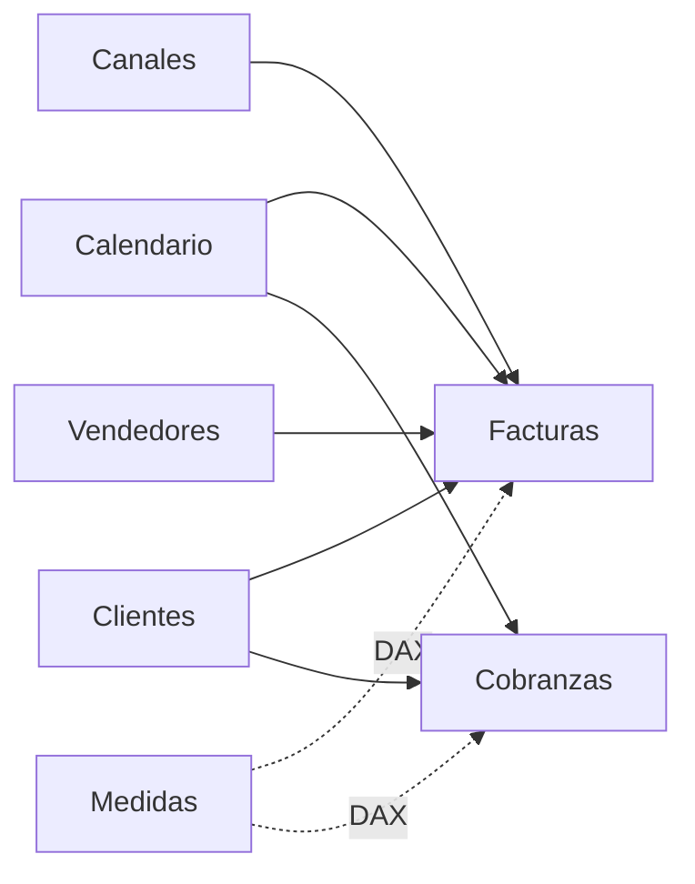

# Análisis de Ventas y Cobranzas con Power BI

Proyecto de **Business Intelligence** desarrollado en Power BI a partir de un caso académico y posteriormente refactorizado para portafolio. El trabajo integra preparación de datos con Power Query, modelado analítico, medidas DAX y un informe de tres páginas orientado al seguimiento comercial.


## Objetivo

Construir un informe que permita:

- monitorear ventas, cobranzas y saldo pendiente;
- analizar desempeño por período, segmento, canal y vendedor;
- explorar detalle por país y ciudad;
- separar hechos, dimensiones y medidas de negocio;
- mantener el proyecto en un formato versionable mediante **Power BI Project (`.pbip`)**, **TMDL** y **PBIR**.

## Datos analizados

| Elemento | Registros / categorías |
|---|---:|
| Facturas | 4.400 |
| Registros de cobranza | 8.396 |
| Clientes | 320 |
| Canales comerciales | 9 |
| Vendedores | 12 |
| Países | 21 |

El período analizado comprende **2014–2016**. Los datos de 2016 son parciales y llegan hasta julio; por ello, ese año no debe compararse directamente con 2014 o 2015 sin considerar esta limitación.

## Modelo de datos



- **Hechos:** `Facturas`, `Cobranzas`
- **Dimensiones:** `Clientes`, `Canales`, `Vendedores`, `Calendario`
- **Medidas:** tabla dedicada `Medidas`

La dimensión `Calendario` se relaciona con ventas y cobranzas e incorpora atributos temporales con ordenamiento explícito para meses y trimestres.

## Preparación de datos con Power Query

Se aplicaron operaciones de conexión, limpieza y transformación, entre ellas:

- carga desde Excel y CSV;
- promoción de encabezados;
- asignación de tipos de datos;
- separación y normalización de campos de ubicación;
- preparación de las tablas utilizadas por el modelo analítico.

Los archivos fuente originales pertenecen al material académico del curso y **no se redistribuyen en este repositorio**. El paquete PBIP usa rutas locales genéricas como referencia; para reproducir una actualización es necesario configurar las fuentes correspondientes en Power BI Desktop.

## Medidas DAX principales

```DAX
Total Ventas =
SUM(Facturas[Monto Factura])

Total Cobros =
SUM(Cobranzas[MontoCobrado])

Saldo Pendiente =
[Total Ventas] - [Total Cobros]

Cantidad Facturas =
COUNTROWS(Facturas)

Clientes con venta =
DISTINCTCOUNT(Facturas[IDCliente])

Ticket Promedio =
DIVIDE([Total Ventas], [Cantidad Facturas])

Tasa Cobranza =
DIVIDE([Total Cobros], [Total Ventas])
```

`Tasa Cobranza` se interpreta como un indicador agregado dentro del contexto de filtro. No corresponde a una tasa de recuperación por cohorte de factura.

## Informe

### 1. Resumen ejecutivo


Incluye ventas, cobros, saldo pendiente, tasa de cobranza, clientes con venta y ticket promedio, además de evolución temporal y segmentación.

### 2. Análisis comercial


Incluye:

- Top 6 vendedores por ventas acumuladas;
- Top 6 canales por ventas acumuladas y composición por segmento;
- ventas por año y segmento;
- composición trimestral;
- evolución de ventas y ticket promedio.

Los conjuntos Top 6 se definen usando el ranking acumulado del período completo; los filtros del informe modifican los valores mostrados dentro de esas categorías.

### 3. Detalle comercial


Incluye una tabla de ventas por canal, país y segmento, una matriz jerárquica y filtros por año, segmento, país y ciudad.

Los filtros de **Año** y **Segmento** se sincronizan entre páginas para mantener el contexto de análisis.

## Resultados descriptivos

- **Ventas acumuladas:** 2.630.002,12
- **Cobros acumulados:** 2.541.968,54
- **Saldo ventas - cobros:** 88.033,58
- **Cobros / ventas:** 96,65 %
- El segmento **Persona** concentra aproximadamente **87,1 %** de las ventas acumuladas.
- **CRM** presenta el mayor monto acumulado entre los canales del conjunto de datos.

Estos resultados describen exclusivamente el conjunto de datos utilizado en el caso.

## Archivos del repositorio

```text
README.md
AnalisisVentas-PBIP.zip
assets/
src/semantic-model/
```

- **`AnalisisVentas-PBIP.zip`** contiene el proyecto completo en formato PBIP, con definiciones PBIR y TMDL.
- **`src/semantic-model/`** expone en texto las piezas técnicas principales del modelo para revisión rápida desde GitHub.
- **`assets/`** contiene capturas limpias de las tres páginas del informe.

Los directorios locales `.pbi/` y los archivos fuente académicos quedan fuera de la publicación.

## Tecnologías

- Power BI Desktop
- Power Query / lenguaje M
- DAX
- Power BI Project (`.pbip`)
- TMDL
- PBIR
- Git / GitHub

## Contexto académico

La versión inicial se desarrolló como actividad final del curso **Power BI: Herramientas Básicas para el Análisis de Datos** de TELEDUC, Pontificia Universidad Católica de Chile. Posteriormente se refactorizaron el modelo, las medidas, las visualizaciones y la documentación para convertirlo en un caso demostrable de portafolio.
