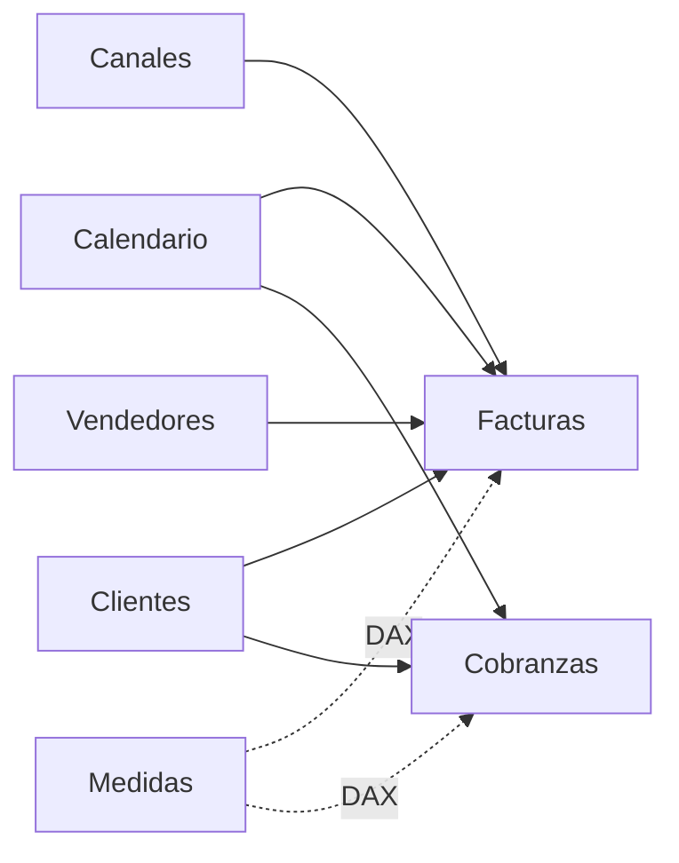

# Análisis de Ventas y Cobranzas con Power BI

Caso de **Business Intelligence en Power BI** orientado al seguimiento de ventas y cobranzas. El proyecto partió como una evaluación académica y fue refactorizado para portafolio: preparación de datos con Power Query, modelo semántico, medidas DAX, calendario común y un dashboard de tres páginas.


## Abrir el proyecto

El proyecto Power BI está versionado en formato **PBIP**:

```text
powerbi/AnalisisVentas.pbip
```

Para revisarlo en Power BI Desktop, clona o descarga el repositorio y abre ese archivo. Las definiciones del informe **PBIR** y del modelo semántico **TMDL** quedan disponibles como texto dentro de `powerbi/`, por lo que también pueden revisarse directamente desde GitHub.

> Los archivos Excel/CSV originales corresponden al material académico del curso y no se redistribuyen. Para actualizar los datos desde otra instalación de Power BI Desktop es necesario configurar las fuentes locales indicadas en Power Query.

## Objetivo

Construir un informe que permita:

- monitorear ventas, cobranzas y saldo pendiente;
- analizar desempeño por período, segmento, canal y vendedor;
- explorar el detalle comercial por país y ciudad;
- mantener una dimensión calendario común para ventas y cobranzas;
- separar hechos, dimensiones y medidas de negocio.

## Alcance de los datos

| Elemento | Registros / categorías |
|---|---:|
| Facturas | 4.400 |
| Registros de cobranza | 8.396 |
| Clientes | 320 |
| Canales comerciales | 9 |
| Vendedores | 12 |
| Países | 21 |

El período analizado comprende **2014–2016**. Los datos de **2016 son parciales hasta julio**, por lo que ese año no debe compararse directamente con 2014 o 2015 sin considerar esta limitación.

## Modelo de datos



- **Tablas de hechos:** `Facturas`, `Cobranzas`
- **Dimensiones:** `Clientes`, `Canales`, `Vendedores`, `Calendario`
- **Medidas:** tabla dedicada `Medidas`

La dimensión `Calendario` incluye año, mes, trimestre y día de semana, con columnas auxiliares para mantener el orden cronológico.

## Preparación de datos con Power Query

Entre las transformaciones aplicadas:

- carga desde Excel y CSV;
- promoción de encabezados;
- asignación de tipos de datos;
- separación y normalización del campo de ubicación;
- preparación de las tablas utilizadas por el modelo.

Las rutas publicadas se dejaron genéricas (`C:\Data\AnalisisVentas\...`) para evitar exponer rutas personales.

## Medidas DAX principales

```DAX
Total Ventas =
SUM(Facturas[Monto Factura])

Total Cobros =
SUM(Cobranzas[MontoCobrado])

Saldo Pendiente =
[Total Ventas] - [Total Cobros]

Cantidad Facturas =
COUNTROWS(Facturas)

Clientes con venta =
DISTINCTCOUNT(Facturas[IDCliente])

Ticket Promedio =
DIVIDE([Total Ventas], [Cantidad Facturas])

Tasa Cobranza =
DIVIDE([Total Cobros], [Total Ventas])
```

`Tasa Cobranza` representa la razón agregada entre cobros y ventas dentro del contexto de filtro; **no** es una tasa de recuperación por cohorte de factura.

## Dashboard

### 1. Resumen ejecutivo


Presenta ventas, cobros, saldo pendiente, tasa de cobranza, clientes con venta y ticket promedio, además de evolución temporal y segmentación.

### 2. Análisis comercial


Incluye:

- seis vendedores con mayor venta acumulada;
- seis canales con mayor venta acumulada y su composición por segmento;
- ventas por año y segmento;
- composición trimestral;
- evolución de ventas y ticket promedio.

Los conjuntos Top 6 se definen usando el ranking acumulado del período completo. Los filtros del informe modifican los valores mostrados dentro de esas categorías.

### 3. Detalle comercial


Incluye tabla de ventas por canal, país y segmento, matriz jerárquica y filtros por año, segmento, país y ciudad.

Los filtros de **Año** y **Segmento** se sincronizan entre páginas para mantener el contexto de análisis.

## Resultados descriptivos

- **Ventas acumuladas:** 2.630.002,12
- **Cobros acumulados:** 2.541.968,54
- **Saldo ventas - cobros:** 88.033,58
- **Cobros / ventas:** 96,65 %
- El segmento **Persona** concentra aproximadamente **87,1 %** de las ventas acumuladas.
- **CRM** presenta el mayor monto acumulado entre los canales del conjunto de datos.

Los resultados anteriores describen exclusivamente este conjunto de datos.

## Estructura del repositorio

```text
.
├── README.md
├── assets/
│   ├── dashboard-resumen-ejecutivo.png
│   ├── dashboard-analisis-comercial.png
│   └── dashboard-detalle-comercial.png
└── powerbi/
    ├── AnalisisVentas.pbip
    ├── AnalisisVentas.Report/
    └── AnalisisVentas.SemanticModel/
```

Los directorios locales de caché `.pbi/`, los archivos fuente académicos y la pauta de evaluación no forman parte de la publicación.

## Tecnologías

- Power BI Desktop
- Power Query / lenguaje M
- DAX
- Power BI Project (`.pbip`)
- TMDL
- PBIR
- Git / GitHub

## Contexto académico

La versión inicial se desarrolló como actividad final del curso **Power BI: Herramientas Básicas para el Análisis de Datos** de TELEDUC, Pontificia Universidad Católica de Chile. Posteriormente se revisaron y refactorizaron el modelo, las medidas, las visualizaciones y la documentación para convertirlo en un proyecto de portafolio.
